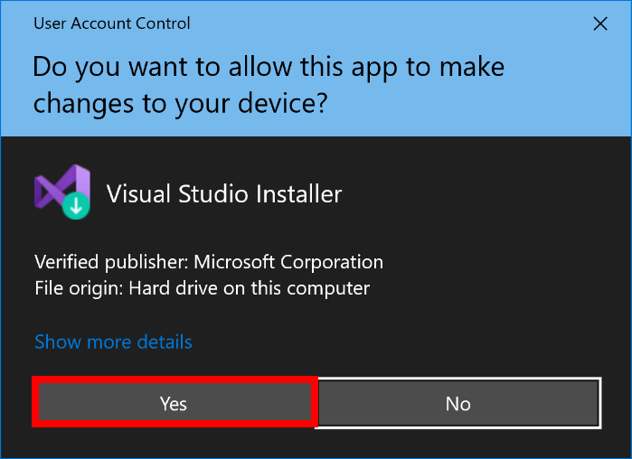
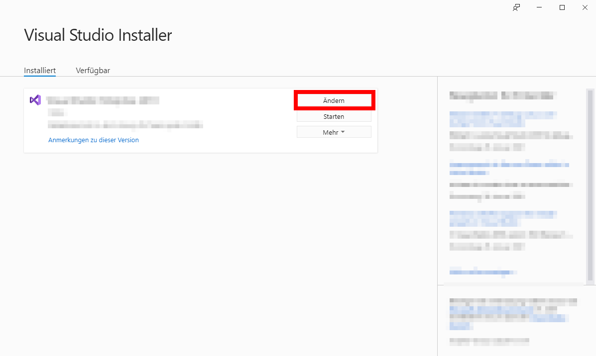
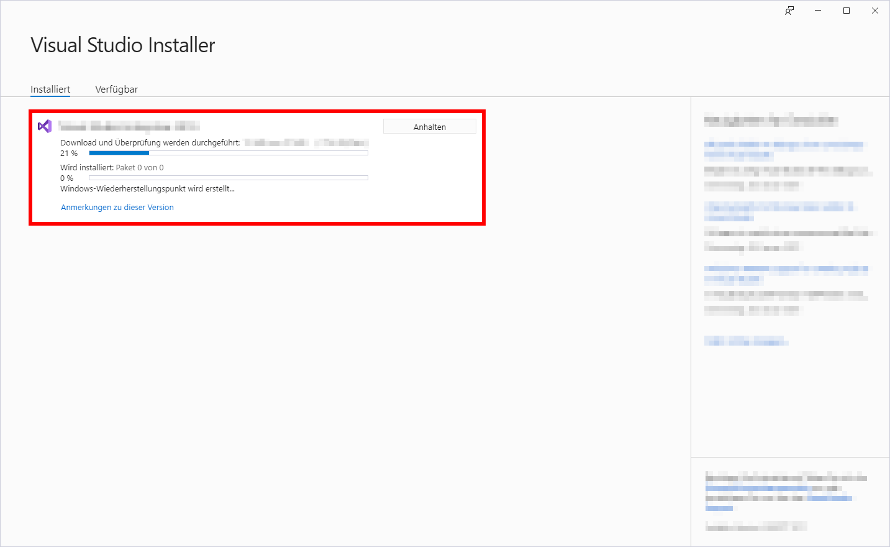
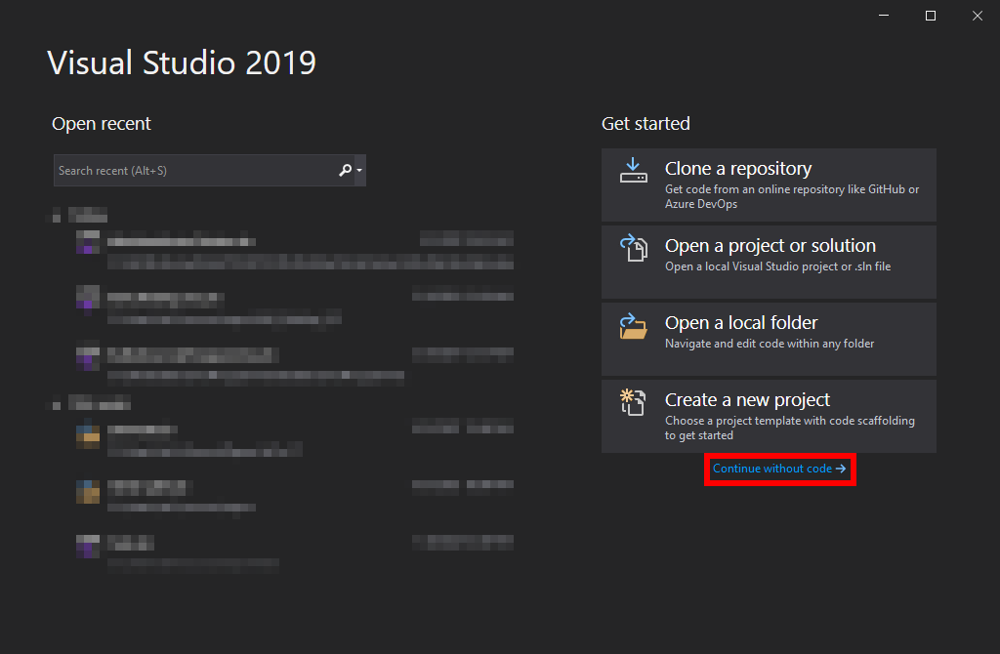
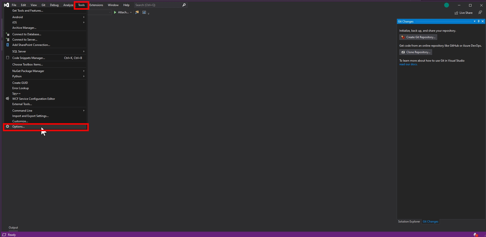
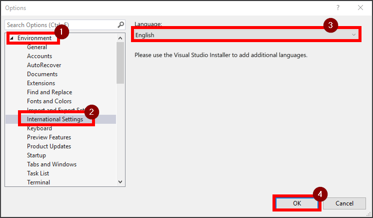
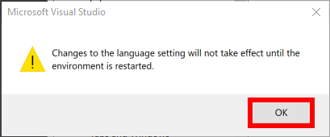

# VS auf Englisch
## 1. Visual Studio Installer öffnen
<kbd>Win</kbd> → ```Visual Studio Installer```


## 2. UserAccountControll
<kbd>Click</kbd> → ```Yes / Ja```



## 3. VS-2019 Ändern
<kbd>Click</kbd> → ```Ändern```



## 4. VS-2019 Sprachpakete
<kbd>Click</kbd> → ```Sprachpakete```

<kbd>Click</kbd> → ```Englisch```

<kbd>Click</kbd> → ```Ändern```


## 5. VS-2019 Downlod / Installieren
Warten bis alles installiert ist.



## 6. VS-2019 Open
<kbd>Open</kbd> → ```Visual Studio 2019```


## 7. VS-2019 Next
<kbd>Click</kbd> → ```Continue without code```



## 8. VS-2019 Next
<kbd>Click</kbd> → ```Tools``` → ```Options...```



## 9. English
<kbd>Click</kbd> → (1)```Environment``` → (2)```Internatonal Settings``` → Language: (3)```English``` → (4)```OK```



## 10. VS-2019 Restart
<kbd>Click</kbd> → ```OK```



# 11. VS2019 Neu Starten!
